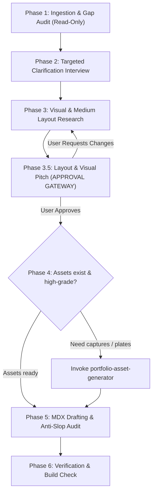

# Portfolio Storyteller Skill: The Craft & Conviction Arc

A specialized skill engineered for **Sumit Nayyar’s portfolio** (`/Users/SumitKumar/Desktop/consulting/portfolio`). Designed to position Sumit as a high-caliber **Lead Product Designer & Design Engineer** bridging human-in-the-loop UX, AI workflows, and frontend systems.

---

## Core Philosophy & The 45-Second Scan Rule

Recruiters, hiring managers, and design executives spend **30 to 45 seconds** on a portfolio case study. Standard textbook "Double Diamond" reports get skipped. 

This skill enforces:
1. **Show Artifacts Early**: Working prototypes and hero interfaces appear in the first 2 scrolls.
2. **Constraint-First Framing**: Every feature is grounded in the human or technical bottleneck that forced its creation.
3. **Zero AI Slop**: Strict vocabulary blacklists, decisive first-person voice, and real technical trade-offs.
4. **Targeted Interview Mode**: Audits existing project notes first, and ONLY asks the user for missing details.
5. **Approval Gateway**: Pitches the proposed visual and layout strategy to the user *before* rewriting or generating code.

---

## The 6-Phase Execution Workflow



---

### Phase 1: Ingestion & Gap Audit (Strictly Read-Only)

When invoked on a project (e.g. `src/content/projects/<slug>/index.mdx`), the skill **must not edit any files**. It first inspects:
1. `src/content/projects/<slug>/index.mdx` (Frontmatter, headings, body text, figures).
2. Existing project images in `src/content/projects/<slug>/`.
3. Links to live prototypes, Figma files, or GitHub repositories.
4. Related files in `.agent/` or project documentation.

Then, it audits the project against the **7 Benchmark Elements**:
- [ ] **Quantified Metric Hook**: A punchy 1-sentence value statement in frontmatter.
- [ ] **Core Intellectual Paradox (The "Why")**: Tension between human behavior and system mechanics.
- [ ] **Upfront Artifact / Live Prototype**: Interactive demo or hero view in the first 2 scrolls.
- [ ] **Comparative Audit**: A scannable *"What Didn't Work vs. What Worked"* table.
- [ ] **3–4 Pivotal Moments (The "How")**: Key interaction decisions with cognitive rationale.
- [ ] **Under-The-Hood Architecture (The "What")**: Tokens, state machines, or component primitives.
- [ ] **Candid Retrospective**: Real compromises and a prioritized "+3 Months" strategy.

---

### Phase 2: Targeted Clarification Interview

The skill will **never invent or hallucinate** metrics, trade-offs, or user testing results.
It produces a concise **Gap Report** and asks the user ONLY about what is missing:

> *"I audited `src/content/projects/<slug>`: Your heuristic audit and prototype link are strong, but we are missing:*
> 1. *What was the single biggest metric or measurable outcome from this project?*
> 2. *What was the #1 technical or scope compromise you had to make due to timeline or engineering constraints?*
> 3. *What would you build next if given 3 additional months on this system?"*

The user answers directly, and the skill records the facts before proceeding.

---

### Phase 3: Visual & Medium Layout Research

Read [visual-layout-patterns.md](file:///.agent/skills/portfolio-storyteller/references/visual-layout-patterns.md). The skill analyzes the project's medium:

* **AI Agent / Workflow Logic**: Use `<EditorialSideBySide>` rows (`Media Left 60%`, `Text 40%`) + `<EditorialGrid2Up>` for Design System plates.
* **B2B / Data Systems & Dashboards**: Use high-density comparative tables + wide `<EditorialGrid2Up>` desktop wireframe comparisons.
* **Consumer / Mobile Apps**: Use 2-up device frames with subtle paper borders + sequential user journey cards.
* **Physical / Spatial Systems**: Full-width architectural environment diagrams with technical annotation callouts.

---

### Phase 3.5: Layout & Visual Pitch (Mandatory Approval Gateway)

**STOP: Do NOT create or modify any project files until the user explicitly approves this pitch.**

Present the proposed strategy to the user using this format:

```markdown
### 📐 Proposed Layout & Visual Strategy for [Project Name]

1. **Medium & Domain Classification**: [e.g. B2B Multi-tenant Data Dashboard]
2. **Recommended Layout Pattern**:
   - Section 01: Hero Hook + Upfront Live Prototype Link
   - Section 02: Heuristic Audit (Comparative Markdown Table)
   - Section 03: Core Flows (2x `<EditorialSideBySide>` for key views)
   - Section 04: Design System (1x `<EditorialGrid2Up>` for tokens & state architecture)
   - Section 05: Impact & Retrospective (+3 Months Strategy)
3. **Media Treatment & Framing**: [e.g. Light-mode desktop captures, 16:10 ratio, 12px rounded borders, subtle paper-card background]
4. **Identified Missing Assets**: [e.g. Need high-res capture of Location Page; need Design System plate]

Does this visual and structural direction look good, or would you like to adjust any components before I draft?
```

---

### Phase 4: Decoupled Asset Orchestration (On-Demand)

If the approved strategy identifies missing or low-resolution assets:
1. Refer to the decoupled skill `portfolio-asset-generator`.
2. Run `node .agent/skills/portfolio-asset-generator/scripts/capture-prototype.mjs` for live prototypes.
3. Verify that all captured media files follow the human-scale rule (`--editorial-media-max-h: 420px`) and are stored in `src/content/projects/<slug>/`.

---

### Phase 5: MDX Drafting & Anti-AI-Slop Verification

Using the template in [case-study-template.mdx](file:///.agent/skills/portfolio-storyteller/templates/case-study-template.mdx), draft the updated `index.mdx`.

#### Strict Anti-Slop Enforcement
Before finalizing, audit against [anti-slop-checklist.md](file:///.agent/skills/portfolio-storyteller/references/anti-slop-checklist.md):
- [ ] **NO BANNED WORDS**: Verify zero instances of *seamlessly, delve, testament, crucial role, revolutionize, holistic, foster, meticulously, robust, intuitive*.
- [ ] **CONSTRAINT FIRST**: Every feature starts with the friction or user bottleneck.
- [ ] **GOOGLE XYZ**: Accomplishments follow *"Accomplished X, measured by Y, by doing Z"*.
- [ ] **DECISIVE FIRST PERSON**: Active practitioner voice (*"I prioritized upfront disclosure because..."*).
- [ ] **REAL COMPROMISE**: At least one genuine compromise documented in the retrospective table.

---

### Phase 6: Verification & Build Check

1. Run `npm run build` from the workspace root to ensure zero TypeScript, Vite, or MDX compilation errors.
2. Verify with Playwright or browser inspection that side-by-side elements, tables, and images align properly.
3. Present the finished case study diff to the user.
